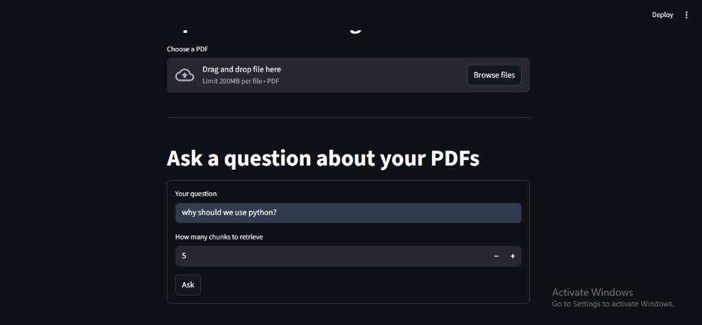
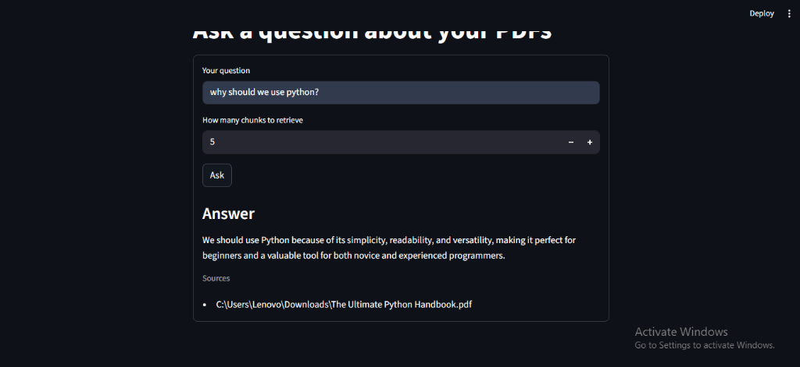
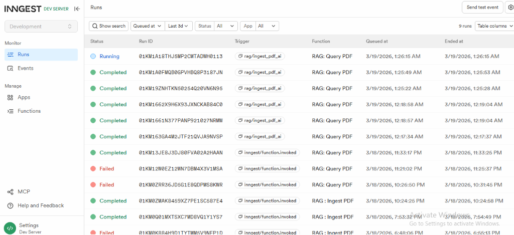
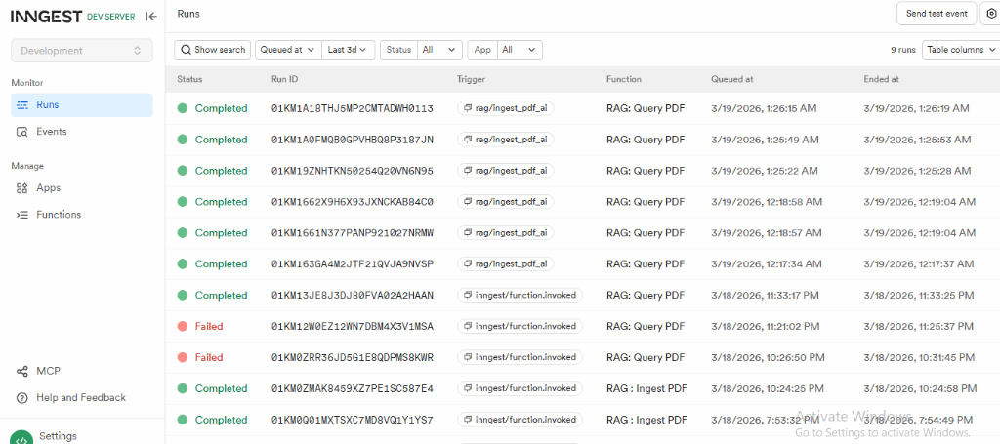

# Multi-Doc RAG with Inngest & Streamlit

A clean and professional RAG (Retrieval-Augmented Generation) pipeline for ingesting PDFs and querying them with AI. Built with **Inngest** for reliable background job orchestration and **Streamlit** for a smooth user interface.

## 🚀 Features

- **Reliable PDF Ingestion**: Background jobs handle heavy lifting like PDF parsing, chunking, and vector indexing.
- **AI-Powered Search**: Context-aware querying using state-of-the-art LLMs (via Groq/OpenAI compatible APIs).
- **Modern Vector Storage**: Low-latency search with Qdrant.
- **Observability**: Real-time tracking of ingestion and query runs via the Inngest Dev Server dashboard.
- **Premium UI**: Sleek, dark-mode Streamlit interface for both management and interaction.

## 📸 Screenshots

| PDF Ingestion | AI Interaction |
| :---: | :---: |
|  |  |

| Inngest Dashboard | Task Visibility |
| :---: | :---: |
|  |  |

## 🛠️ Tech Stack

- **Framework**: [FastAPI](https://fastapi.tiangolo.com/) & [Inngest](https://www.inngest.com/)
- **Frontend**: [Streamlit](https://streamlit.io/)
- **Vector DB**: [Qdrant](https://qdrant.tech/)
- **Embedding Model**: `all-MiniLM-L6-v2` (Sentence-Transformers)
- **AI Models**: Llama 3 (via Groq)
- **PDF Engine**: LlamaIndex Readers

## 🛠️ Prerequisites

- Python 3.13+
- [uv](https://github.com/astral-sh/uv) (Recommended package manager)
- Qdrant (Running locally at `http://localhost:6333`)
- [Inngest CLI](https://www.inngest.com/docs/local-development)

## 📦 Installation & Setup

1. **Clone the repository**:
   ```bash
   git clone https://github.com/YOUR_USERNAME/YOUR_REPOSITORY.git
   cd Multi_Doc-RAG
   ```

2. **Setup environment variables**:
   Create a `.env` file from the provided template:
   ```bash
   GROQ_API_KEY=your_api_key_here
   ```

3. **Install dependencies**:
   ```bash
   uv sync
   ```

## 🚀 Running the Application

1. **Start the Inngest Dev Server**:
   ```bash
   npx inngest-cli@latest dev -u http://127.0.0.1:8000/api/inngest
   ```

2. **Run the FastAPI Backend**:
   ```bash
   uv run uvicorn main:app
   ```

3. **Launch the Streamlit Frontend**:
   ```bash
   uv run streamlit run streamlit_app.py
   ```

## 📄 License

This project is open-source and available under the [MIT License](LICENSE).
